<div align="center">

<a href="https://evolink.ai/models">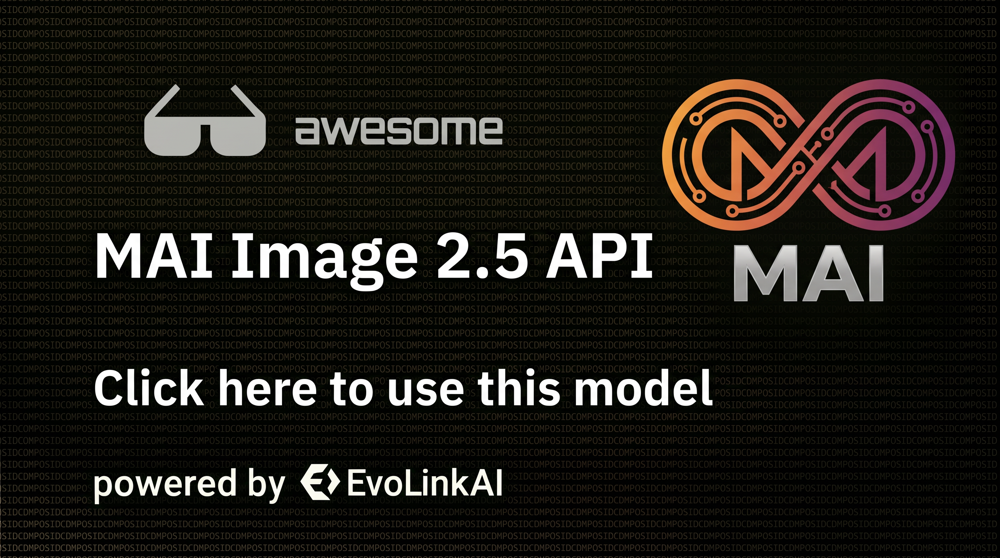</a>

# Awesome MAI-Image-2.5 Prompts

[](LICENSE)
[](https://evolink.ai/models)
[](https://evolink.ai/models)
[](https://evolink.ai/models)
[](https://evolink.ai/models)

[](README.md)
[](README_es.md)
[](README_pt.md)
[](README_ja.md)
[](README_ko.md)
[](README_de.md)
[](README_fr.md)
[](README_tr.md)
[](README_zh-TW.md)
[](README_zh-CN.md)
[](README_ru.md)

</div>

## 🍌 Introduction

Bienvenue dans le dépôt de prompts MAI-Image-2.5 ! 🤗

**Nous rassemblons des prompts et des exemples d'images de haute qualité pour MAI-Image-2.5 et MAI-Image-2.5-Flash de Microsoft, couvrant portraits, illustration, affiches et retouche d'image.**

MAI-Image-2.5 est le premier modèle d'image entièrement maison de Microsoft, présenté à la Microsoft Build 2026 : entraîné de zéro sans distillation, il se classe #2 sur l'Image Edit Arena et #3 en text-to-image. Il est conçu pour un éclairage photoréaliste, des retouches précises préservant l'identité et le texte, et un excellent rapport qualité-prix.

<div align="center">

<a href="https://x.com/arena/status/2061887242579382660">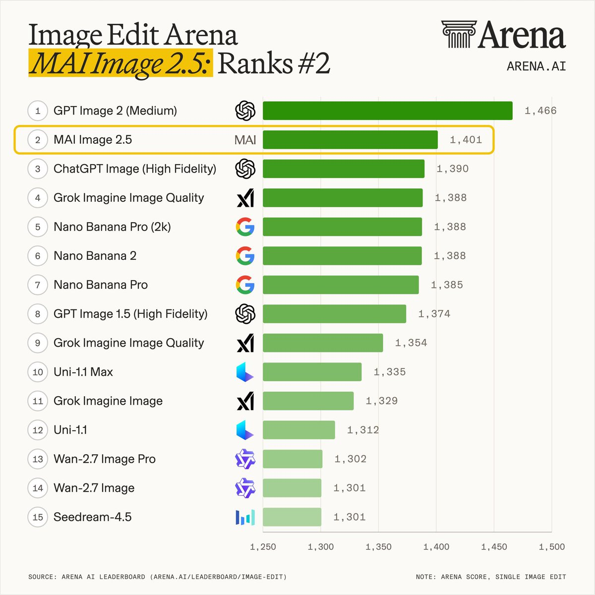</a>

***MAI-Image-2.5 se classe #2 sur l'Image Edit Arena (score 1401), devant toutes les variantes de Nano Banana.*** (classement par [@arena](https://x.com/arena))

</div>

La plupart des cas de ce dépôt proviennent de X/Twitter, de communautés de créateurs et de démos publiques. L'auteur d'origine est crédité pour chaque cas.

Essayez-le sur Evolink: [MAI-Image-2.5](https://evolink.ai/models)

Si cela vous est utile, pensez à mettre une étoile. ⭐

> [!NOTE]
> Ce dépôt se concentre sur des schémas de prompts réutilisables et des cas de référence. Les prompts marqués **reconstruit** sont des reconstitutions fidèles d'un résultat présenté dont l'auteur n'a pas publié le texte exact — ils sont clairement signalés pour que vous ne les confondiez jamais avec les mots exacts de l'auteur.

## 📰 Actualités

- **15 juin 2026 :** Ajout d’un cas Affiches et illustration issu de la fenêtre de curation du 14 juin — Paysage de Volkswagen Bus au clair de lune par @stevegilham1.
- **June 14, 2026:** Added 1 Comparison & Community example from the June 11-12 curation batch — Nested Fruits Cutaway by @aniruddhadak.
- **14 juin 2026 :** Ajout d’un cas Poster & Illustration issu du dernier lot de curation — サイバーパンク女騎士 par @madonomori.
- **5 juin 2026 :** 3 nouveaux cas sélectionnés ont été ajoutés — deux entrées Poster & Illustration et un nouvel exemple Comparison issus du lot de curation du 4 au 5 juin.
- **June 4, 2026:** Première publication du dépôt — 15 cas MAI-Image-2.5 sélectionnés dans les catégories Portraits, Affiches et Comparaisons.

## 📑 Menu

- [🍌 Introduction](#-introduction)
- [📰 Actualités](#-actualités)
- [📑 Menu](#-menu)
- [📸 Portraits et photographie](#-portraits-et-photographie)
  - [Case 1: Editorial Fashion Portrait, Golden Hour (by @atomtanstudio)](#case-1-editorial-fashion-portrait-golden-hour-by-atomtanstudio)
  - [Case 2: Fashion Sense Battle, Character Consistency (by @grmchn4ai)](#case-2-fashion-sense-battle-character-consistency-by-grmchn4ai)
  - [Case 3: 90s OVA Retro-Cel Anime Style (by @doerstokyo342)](#case-3-90s-ova-retro-cel-anime-style-by-doerstokyo342)
  - [Case 4: Photorealistic Iceberg & Breaching Whale (by @annjose)](#case-4-photorealistic-iceberg--breaching-whale-by-annjose)
  - [Case 5: Amateur iPhone Mirror Selfie (by @SqueakAlGaib)](#case-5-amateur-iphone-mirror-selfie-by-squeakalgaib)
  - [Case 6: Full-Body Office Portrait with Signage (by @thesoragirls)](#case-6-full-body-office-portrait-with-signage-by-thesoragirls)
  - [Case 7: Sepia Chiaroscuro Fashion Portrait (by @Chain_Loader)](#case-7-sepia-chiaroscuro-fashion-portrait-by-chain_loader)
- [🎨 Affiches et illustration](#-affiches-et-illustration)
  - [Case 1: Sumi-e Ink Wash Illustration (by @mk0600937254693)](#case-1-sumi-e-ink-wash-illustration-by-mk0600937254693)
  - [Case 2: Anime Character Illustration (by @WaifuGacha)](#case-2-anime-character-illustration-by-waifugacha)
  - [Case 3: Pose Edit with Art-Style Preservation (by @genel_ai)](#case-3-pose-edit-with-art-style-preservation-by-genel_ai)
  - [Case 4: Romantic Sublime Cliff Scene (by @RockGrokAI)](#case-4-romantic-sublime-cliff-scene-by-rockgrokai)
  - [Case 5: Historical Gummies & Chibi Emperors (by @Gdgtify)](#case-5-historical-gummies--chibi-emperors-by-gdgtify)
  - [Case 6: Cybernetic Horse in Luminous Hall (by @RockGrokAI)](#case-6-cybernetic-horse-in-luminous-hall-by-rockgrokai)
  - [Case 7: サイバーパンク女騎士 (by @madonomori)](#case-7-サイバーパンク女騎士-by-madonomori)
  - [Case 8: Paysage de Volkswagen Bus au clair de lune (by @stevegilham1)](#case-8-moonlit-volkswagen-bus-landscape-by-stevegilham1)
- [🆚 Comparaisons et exemples de la communauté](#-comparaisons-et-exemples-de-la-communauté)
  - [Case 1: Object Removal Edit, Text & Car (by @WolfRiccardo)](#case-1-object-removal-edit-text--car-by-wolfriccardo)
  - [Case 2: MAI-Image-2.5 vs Nano Banana Pro (by @eyupyusufa)](#case-2-mai-image-25-vs-nano-banana-pro-by-eyupyusufa)
  - [Case 3: Text-to-Image vs Nano Banana 2 (by @mrc_748)](#case-3-text-to-image-vs-nano-banana-2-by-mrc_748)
  - [Case 4: Flash vs Standard (by @400_yen)](#case-4-flash-vs-standard-by-400_yen)
  - [Case 5: Official Editing Before/After (OneDrive Photos) (by @MicrosoftAI)](#case-5-official-editing-beforeafter-onedrive-photos-by-microsoftai)
  - [Case 6: Anime Character Sheet Comparison (by @wish_society)](#case-6-anime-character-sheet-comparison-by-wish_society)
  - [Case 7: Flooded Taiga Night Train Edit (by @SqueakAlGaib)](#case-7-flooded-taiga-night-train-edit-by-squeakalgaib)
  - [Case 8: Nested Fruits Cutaway (by @aniruddhadak)](#case-8-nested-fruits-cutaway-by-aniruddhadak)
- [🙏 Remerciements](#-remerciements)

## 📸 Portraits et photographie

### Case 1: [Editorial Fashion Portrait, Golden Hour](https://x.com/atomtanstudio/status/2061905270025150679) (by [@atomtanstudio](https://x.com/atomtanstudio))

| Résultat (gauche: MAI-Image-2.5, droite: Nano Banana Pro) |
| :----: |
| 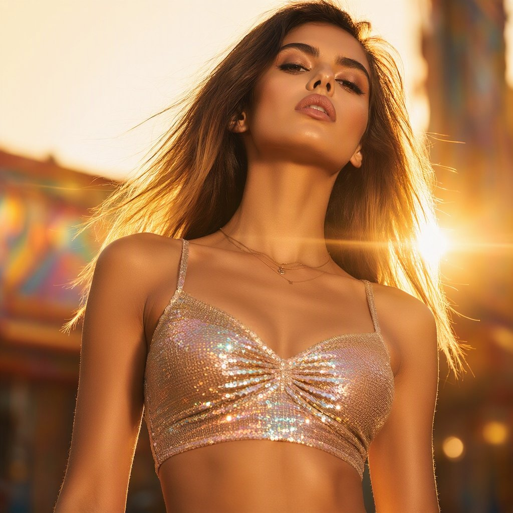 |

**Prompt:**

```
{
  "meta": {
    "active_style_trigger": "Editorial Fashion Mode",
    "intent": "Forensic Replication v3.3.1 (Full Scan)",
    "priorities": ["Anatomical Magnitude Locking", "High-Contrast Backlighting", "Material Iridescence"]
  },
  "frame": {
    "aspect_ratio": "4:5",
    "composition": "Low-angle medium shot, upward-tilt perspective",
    "layout": "Subject centered, dominant verticality, lens flare bisecting the midground"
  },
  "subject": {
    "core_identity": {
      "demographics": "Caucasian female",
      "biological_age_estimate": "22-25",
      "body_composition": "Ectomorph (slender neck, narrow ribcage, lean limbs)"
    },
    "face_forensics": {
      "hair_complex": {
        "fiber_texture": "Straight to wavy, fine-strand high-fidelity fibers",
        "color_variation": "Deep espresso roots transitioning to amber-translucent edges under intense light"
      },
      "facial_topography": {
        "eyes_orbital": "Dark brown irises, almond-shaped, subtle cat-eye makeup",
        "mouth_and_lips": "Full, plush lips; soft matte-pink finish with defined cupid's bow",
        "skin_physics": "Luminous, structural-first lighting; minimal texture; editorial glow"
      }
    },
    "pose_mechanics": {
      "geometric_lock": "Slight shoulder rotation, chin elevated, gaze directed downward toward the lens",
      "expression": "Relaxed, parted lips"
    }
  },
  "wardrobe": {
    "items": [
      { "item": "Iridescent sequined/holographic crop top", "details": "Metallic mesh, thin straps, prismatic shifts (pink, gold, cyan)" }
    ]
  },
  "environment": { "location": "Outdoor urban/carnival setting", "context": "Golden hour, high-contrast backlighting" },
  "lighting": { "setup": "Natural backlighting (Golden Hour Sun)", "direction": "180-degree rear-angle", "quality": "Hard rim light with soft wrap-around fill via flare diffusion" },
  "camera": { "lens": "35mm wide-angle equivalent", "aperture": "f/1.8", "focus_plane": "Subject's facial features (eyes/lips)" },
  "style": { "aesthetic": "High-fashion editorial, cinematic sun-drenched photography", "color_grading": "Warm amber tones", "film_stock": "Modern digital sensor with intentional anamorphic-style flaring" }
}
```

> [!NOTE]
> Prompt JSON structuré, mot pour mot de l'auteur (légèrement abrégé pour la longueur — version complète dans [`cases/portrait.md`](cases/portrait.md)). MAI-Image-2.5 accepte aussi les prompts en langage naturel ; le format JSON verrouille de nombreux attributs d'un coup.

---

### Case 2: [Fashion Sense Battle, Character Consistency](https://x.com/grmchn4ai/status/2061924642571559406) (by [@grmchn4ai](https://x.com/grmchn4ai))

| Résultat |
| :----: |
| 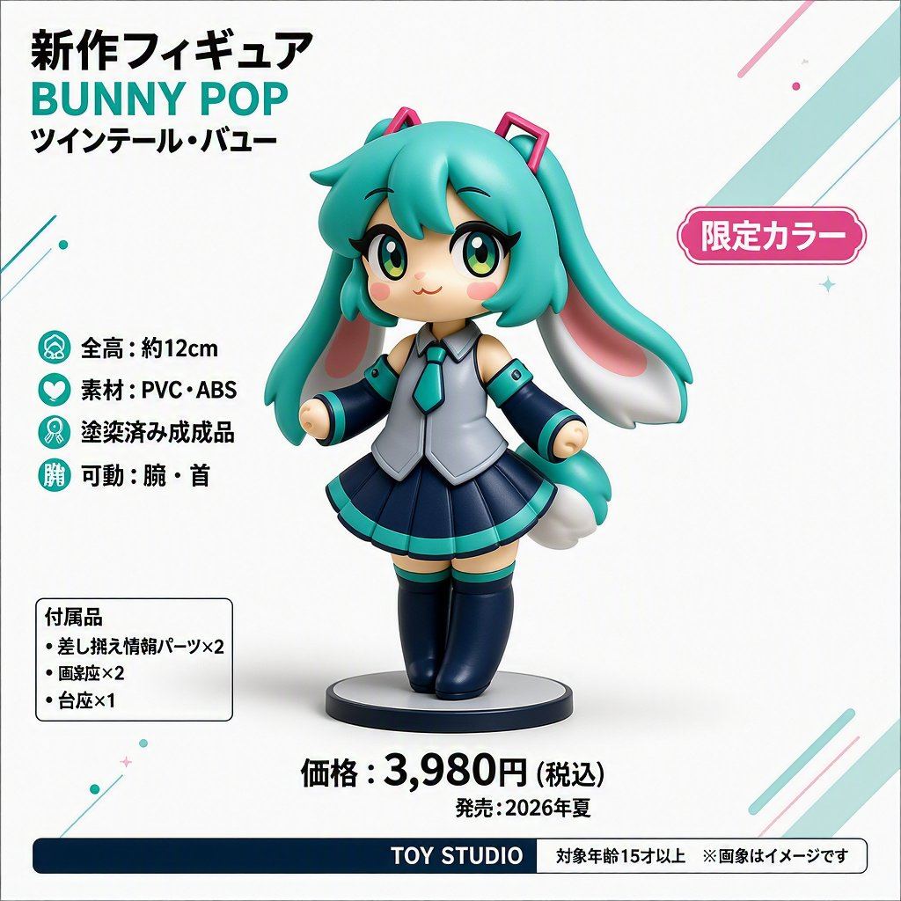 |

**Prompt:**

```
A 5x3 grid lookbook of the SAME young woman styled in fifteen different complete outfits — streetwear, formal evening, casual denim, athleisure, vintage, avant-garde, business, bohemian, etc. Keep her face, hairstyle and body identity perfectly consistent across every cell. Full-body fashion photography, neutral studio backdrop, soft even lighting, sharp focus, magazine styling. Each look distinct in color palette, silhouette and accessories while the person stays recognizably the same.
```

> [!NOTE]
> **Prompt reconstruit.** Le tweet d'origine utilisait un prompt de comparaison de "sens de la mode" d'un tiers et n'a pas publié son texte exact ; ceci est une reconstitution fidèle de la tâche.

---

### Case 3: [90s OVA Retro-Cel Anime Style](https://x.com/doerstokyo342/status/2062060899935100935) (by [@doerstokyo342](https://x.com/doerstokyo342))

| Résultat |
| :----: |
| 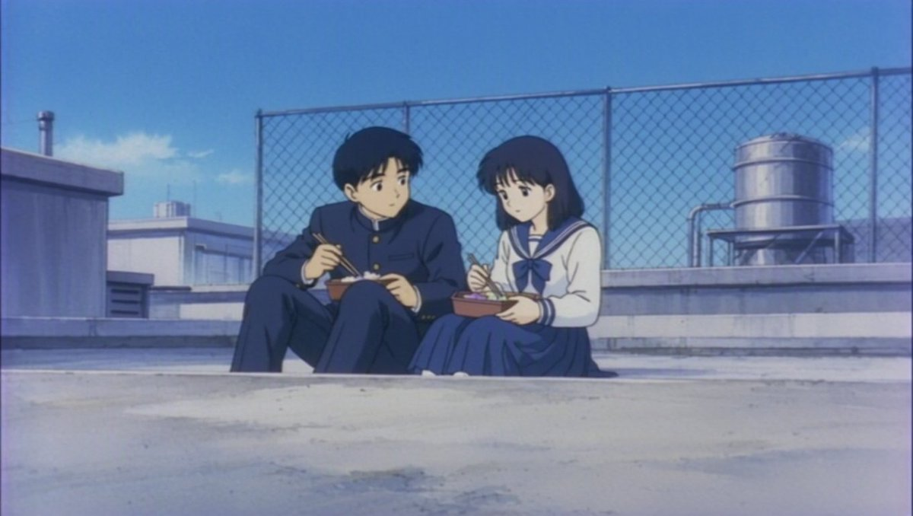 |

**Prompt:**

```
A character portrait in authentic late-1990s OVA anime style: hand-painted cel-shading, slightly grainy film texture, muted retro color palette, visible cel-paint banding, soft analog glow. Detailed but not hyper-clean — the imperfect, nostalgic look of vintage Japanese animation cels rather than modern high-resolution rendering. Dramatic anime lighting, expressive eyes, period-accurate character design.
```

> [!NOTE]
> **Prompt reconstruit** d'après la description de l'auteur testant des styles "90s OVA retro-cel". Ajustez la référence de décennie/studio pour changer d'époque.

---

### Case 4: [Photorealistic Iceberg & Breaching Whale](https://x.com/annjose/status/2062032759993057737) (by [@annjose](https://x.com/annjose))

| Étape 1 : Iceberg | Étape 2 : + Baleine | Étape 3 : + Coucher de soleil |
| :-------------: | :-------------: | :--------------: |
| 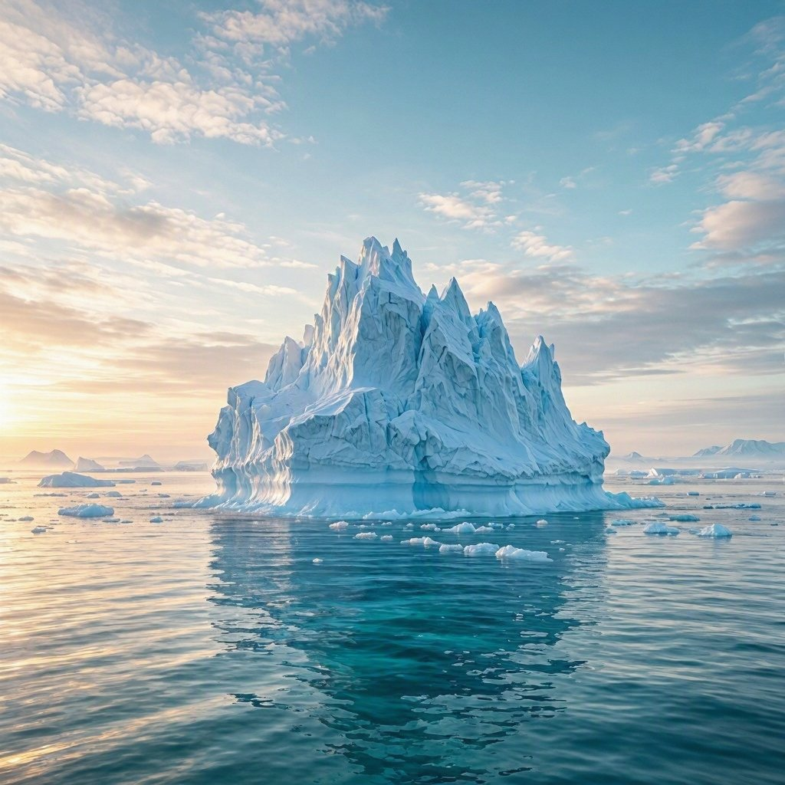 | 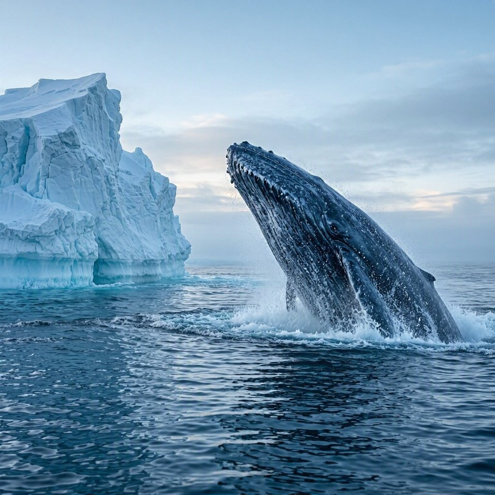 | 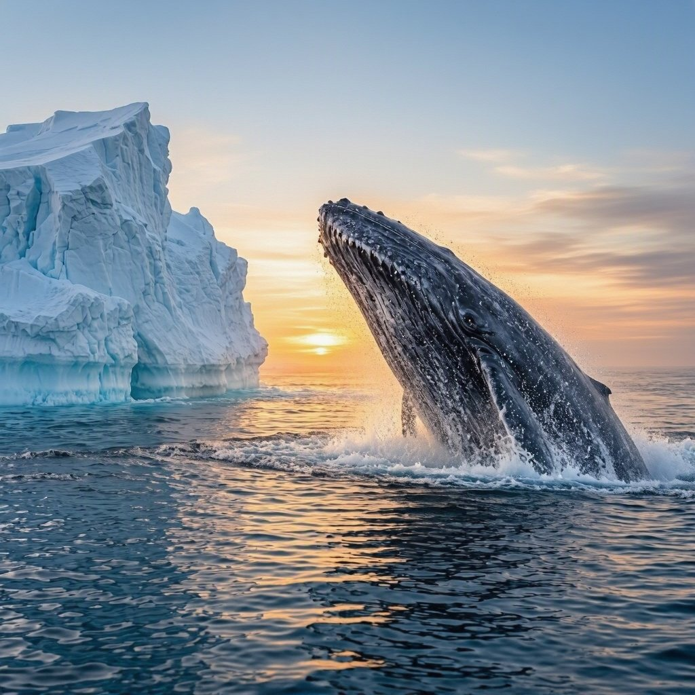 |

**Prompt:**

```
1. create an image of an iceberg in a beautiful ocean with stunning photorealistic way
2. add a bluewhale jumping from the water near the iceberg
3. show the sun setting in the horizon
```

> [!NOTE]
> Prompts mot pour mot de l'auteur, appliqués comme trois retouches successives sur la même image. Exécutez-les l'un après l'autre pour construire la scène étape par étape.

---

### Case 5: [Amateur iPhone Mirror Selfie](https://x.com/SqueakAlGaib/status/2062292091418628270) (by [@SqueakAlGaib](https://x.com/SqueakAlGaib))

| Résultat |
| :----: |
| 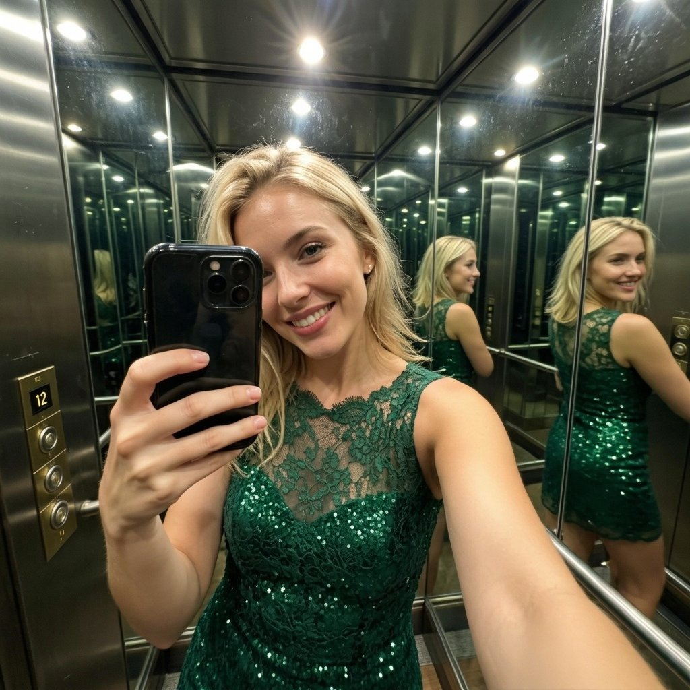 |

**Prompt:**

```
Ultra-realistic amateur iPhone front-camera selfie inside a luxury hotel elevator. A stunning young blonde American woman in her mid-20s wearing a fashionable short designer cocktail dress stands casually inside the elevator before a night out. The image feels completely unplanned and spontaneous, not posed for social media. She is naturally beautiful with a charismatic smile, healthy skin texture, subtle makeup, and realistic imperfections. The elevator walls are mirrored on three sides, creating multiple reflections at different angles. The smartphone partially obscures part of her face. Some reflections are cropped by the edge of the frame. Bright ceiling LEDs create realistic glare streaks and reflections across the mirrors. Tiny fingerprints and smudges are visible on the mirror surface. Slight wide-angle front-camera distortion. Uneven framing. One shoulder partially cropped. Authentic smartphone HDR processing. Natural color science. No studio lighting. No influencer aesthetic. The image should feel like an accidental snapshot discovered in a camera roll. Shot on an iPhone front camera, extremely realistic optics, realistic skin pores, realistic fabric texture, subtle sensor noise, slight motion blur in one hand, genuine amateur photography, impossible to distinguish from a real smartphone photo.
```

> [!NOTE]
> Prompt mot pour mot de l'auteur, issu d'un test text-to-image face à Nano Banana 2, GPT-Image 2.0 et Grok Imagine. Le cadrage "amateur / instantané accidentel" et les imperfections explicites sont ce qui crée le réalisme.

---

### Case 6: [Full-Body Office Portrait with Signage](https://x.com/thesoragirls/status/2062384216210391340) (by [@thesoragirls](https://x.com/thesoragirls))

| Résultat |
| :----: |
| 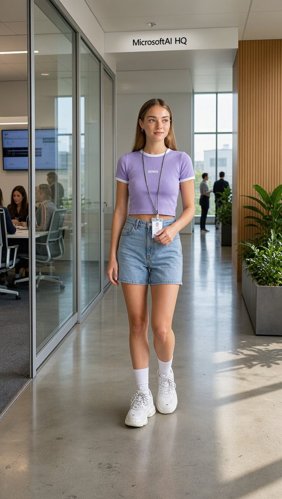 |

**Prompt:**

```
Full-body photorealistic portrait of a young woman walking through a modern tech-office corridor, wearing a lavender cropped tee, denim shorts, white crew socks and chunky white sneakers, an ID badge on a lanyard. Glass-walled meeting rooms with people working in the background, warm wood-panel accents, large windows with soft daylight, polished concrete floor. Wall signage reads "MicrosoftAI HQ". 9:16 vertical, natural lighting, sharp focus, realistic skin and fabric texture, candid editorial feel.
```

> [!NOTE]
> **Prompt reconstruit.** L'auteur a publié le résultat ("Image generated with MAI-Image-2.5") sans le texte du prompt. Bon exemple de plein pied + rendu de texte dans la scène — modifiez le texte du panneau et la tenue pour l'adapter.

### Case 7: [Sepia Chiaroscuro Fashion Portrait](https://x.com/Chain_Loader/status/2063068538588541177) (by [@Chain_Loader](https://x.com/Chain_Loader))

| Output A | Output B |
| :------: | :------: |
| 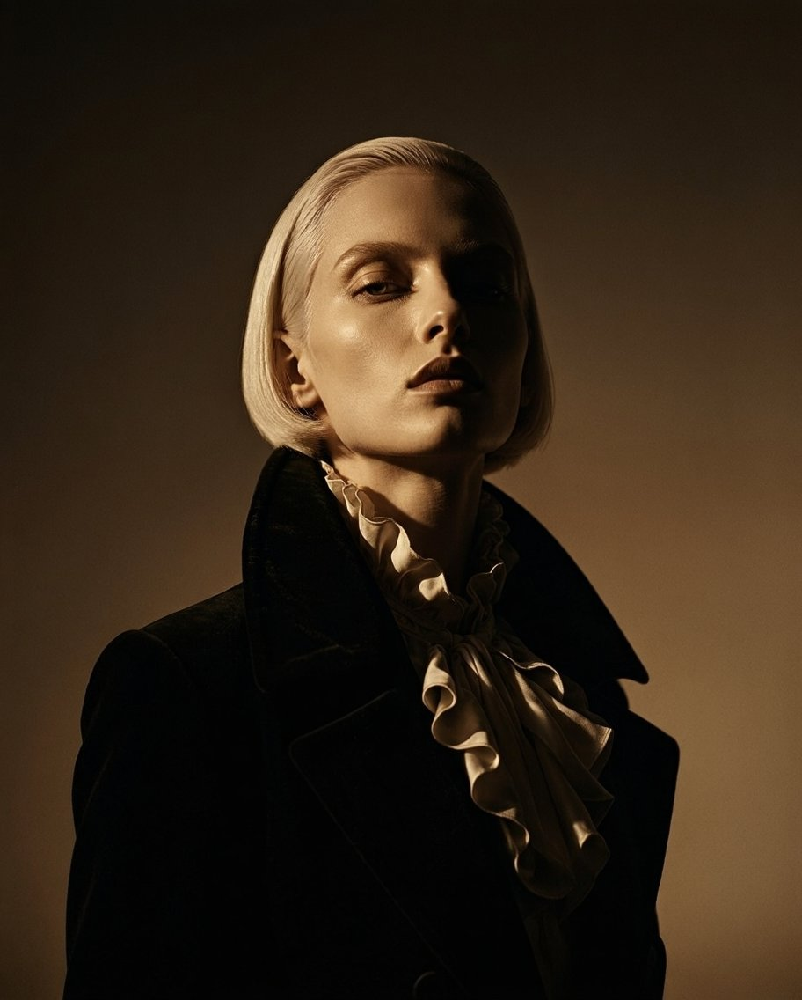 | 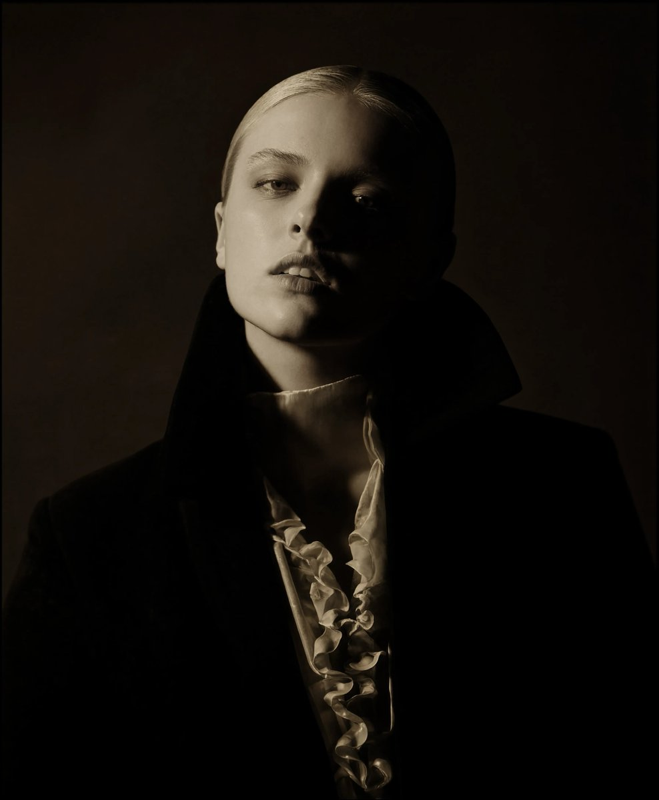 |

**Prompt:**

```
Prompt pt.1

Cinematic medium close-up, low center framing. Young woman with knife-sharp cheekbones and a severe platinum bob slicked back with geometric precision. She stares down into the lens from a slightly elevated chin, eyes narrowed in controlled hostility, lips parted in breathless stillness. A heavy black velvet coat with a fortress-like high collar wraps her throat in darkness, exposing only the antique silk blouse beneath - its ruffled collar erupts from the void like a broken wave of cream and shadow, each fold catching a dying amber light at its crest.

The background is a bottomless gradient from scorched earth brown to warm ash grey, seamless and infinite. Her face is split by a hard diagonal shadow: one side bathed in warm low light that carves the cheekbone into a blade, the other side falling into absolute black where the coat, the hair, and the lost eye become one continuous silhouette. The boundary between light and dark is sharp enough to cut. […]

Prompt pt.2

[…] Sepia-toned with molten archival depth, rich sooty blacks in the velvet, luminous warm highlights on the silk and skin. Fine film grain, restrained contrast that favors shadow detail over mid-tones, a sense of arrested time. No soft focus, no romantic haze, no visible illumination tools. No frame, no border, no vignette, no physical photo artifacts. Brutal elegance, silent accusation in the gaze, fabric as armor. Aspect ratio: 4:5
```

> [!NOTE]
> Public prompt text is available in the tweet's alt text and is visibly truncated with ellipses, so this is preserved as a partial verbatim prompt rather than reconstructed into a fake full version. The visual result is still strong enough to keep as a portrait/style reference.

## 🎨 Affiches et illustration

### Case 1: [Sumi-e Ink Wash Illustration](https://x.com/mk0600937254693/status/2062147536606126244) (by [@mk0600937254693](https://x.com/mk0600937254693))

| Résultat |
| :----: |
| 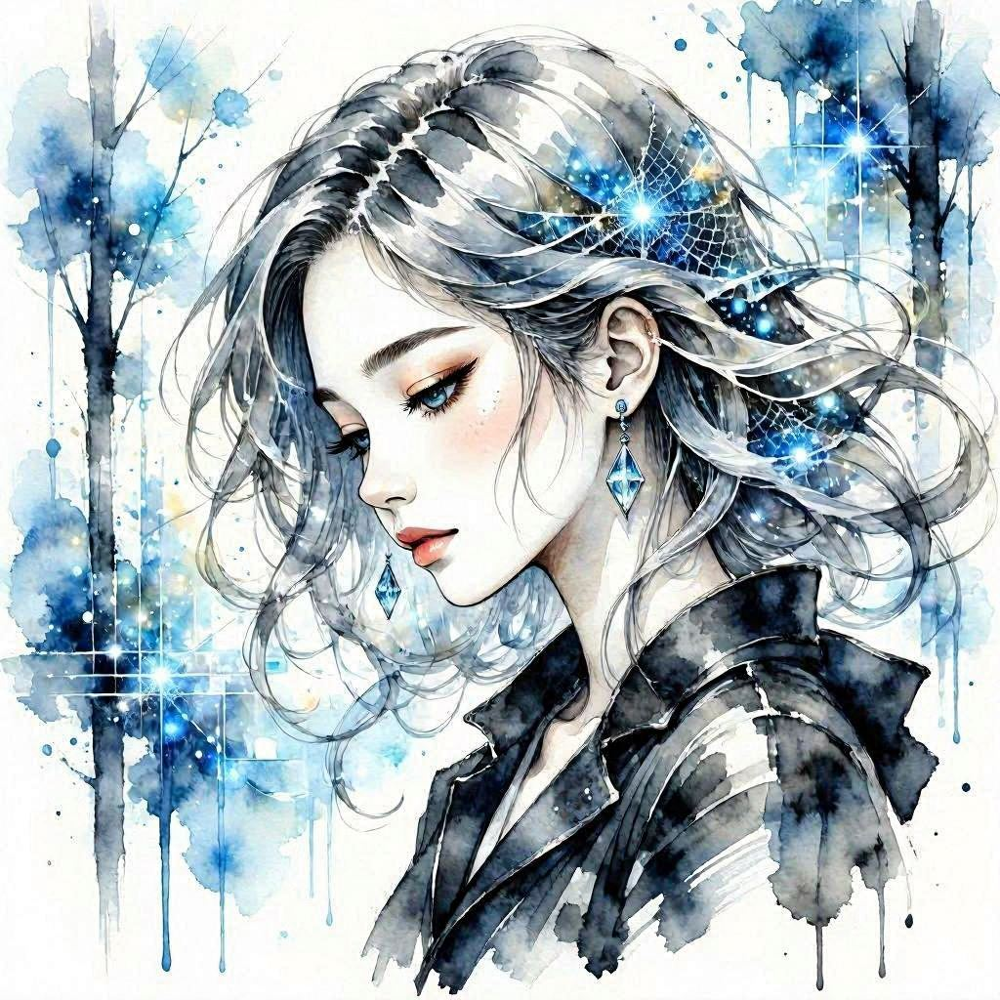 |

**Prompt:**

```
A traditional Japanese sumi-e ink-wash painting with a soft watercolor feel. Expressive black ink brushstrokes with controlled bleeding and gradient washes on textured washi paper, generous negative space, minimal restrained color accents. Calm, meditative composition in the style of classical East Asian ink art.
```

> [!NOTE]
> **Prompt reconstruit** d'après la description de l'auteur (墨絵 / impression d'aquarelle). Changez le sujet pour appliquer ce style à l'encre à n'importe quel motif.

---

### Case 2: [Anime Character Illustration](https://x.com/WaifuGacha/status/2062160277425283384) (by [@WaifuGacha](https://x.com/WaifuGacha))

| Résultat |
| :----: |
| 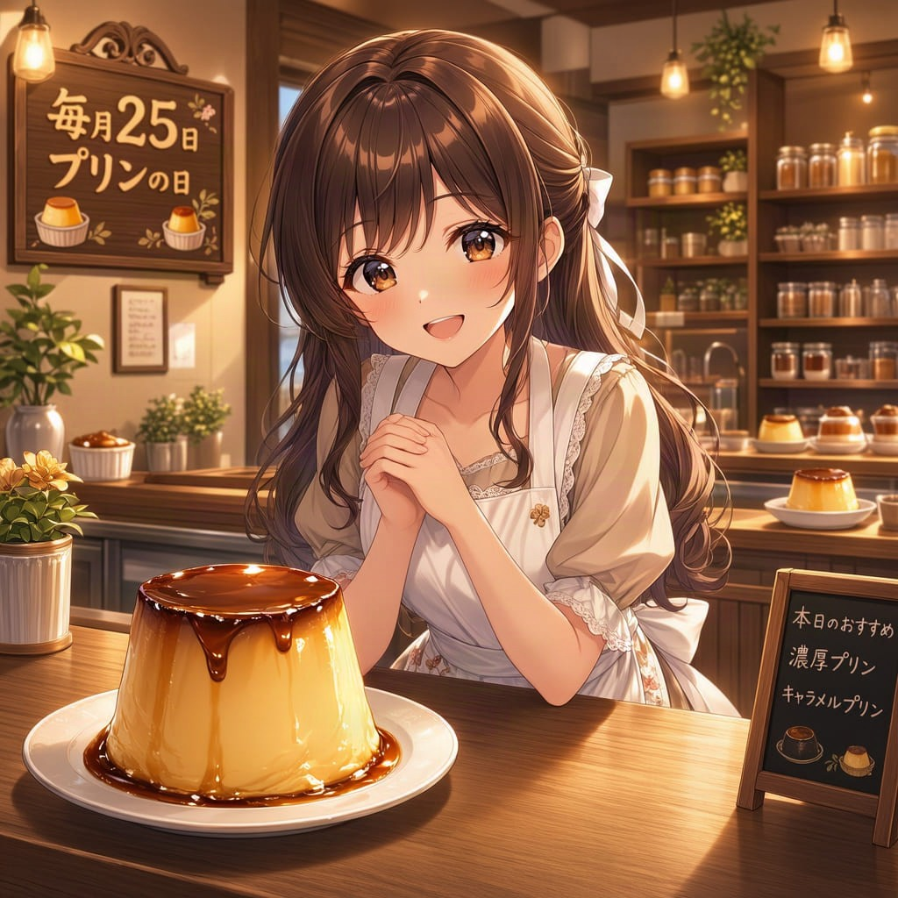 |

**Prompt:**

```
A high-quality anime illustration of an original character, clean lineart, vibrant cel-style coloring, detailed eyes and hair shading, dynamic composition, soft background bokeh. Modern Japanese illustration aesthetic with crisp linework and polished color grading.
```

> [!NOTE]
> **Prompt reconstruit.** La publication d'origine ne montrait que le résultat, sans publier le texte du prompt.

---

### Case 3: [Pose Edit with Art-Style Preservation](https://x.com/genel_ai/status/2062100730899763367) (by [@genel_ai](https://x.com/genel_ai))

| Résultat |
| :----: |
| 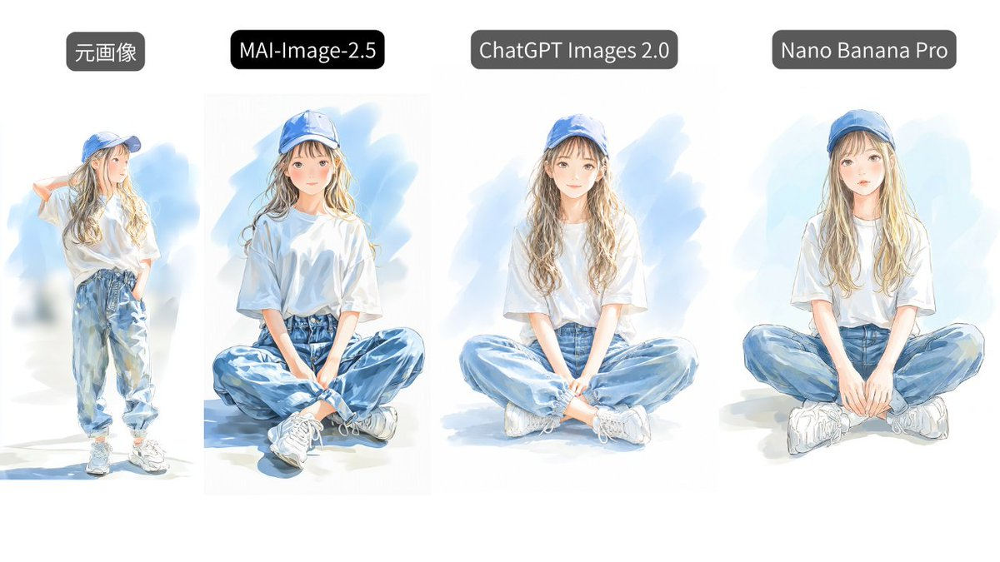 |

**Entrée:** Importez une illustration à modifier.

**Prompt:**

```
Change only the character's pose to [new pose] while keeping the original artwork's line style, coloring, character identity, and overall aesthetic completely unchanged. Do not redraw the face or alter the art style — preserve the source illustration's look and only restage the body position.
```

> [!NOTE]
> **Prompt de retouche reconstruit.** Remplacez `[new pose]` par la pose voulue. Met en avant la force de MAI-Image-2.5 pour retoucher des illustrations en préservant le style d'origine.

---

### Case 4: [Romantic Sublime Cliff Scene](https://x.com/RockGrokAI/status/2062188994805281183) (by [@RockGrokAI](https://x.com/RockGrokAI))

| Résultat |
| :----: |
| 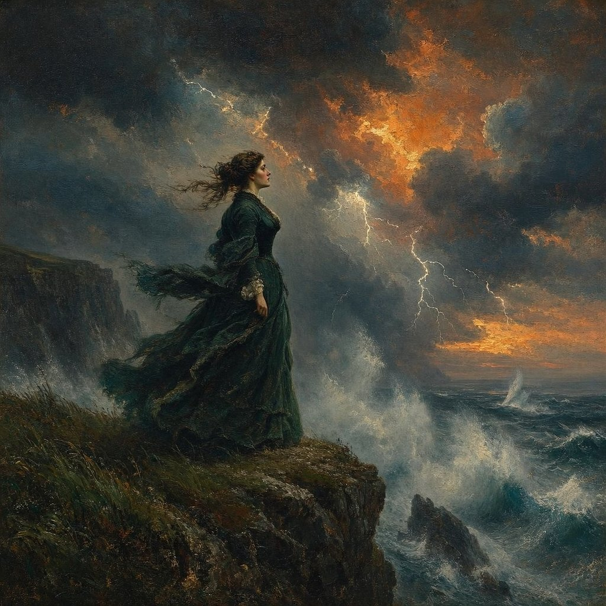 |

**Prompt:**

```
Set in mid 19th-century, a solitary young woman standing on stormy cliff edge, waves crashing in sublime fury below turbulent sky. 19th-century Romantic sublime, dramatic blue, stormy gray, fiery orange, lush green, overwhelming nature. Raging turbulent storm lightning, heroic low-angle tempestuous windswept pan.
```

> [!NOTE]
> Prompt mot pour mot de l'auteur. Nommer l'époque ("mid 19th-century") et le mouvement artistique ("Romantic sublime") ancre fortement le style pictural.


### Case 5: [Historical Gummies & Chibi Emperors](https://x.com/Gdgtify/status/2062463116852539651) (by [@Gdgtify](https://x.com/Gdgtify))

| Historical Gummies | Chibi Emperors |
| :----------------: | :------------: |
| 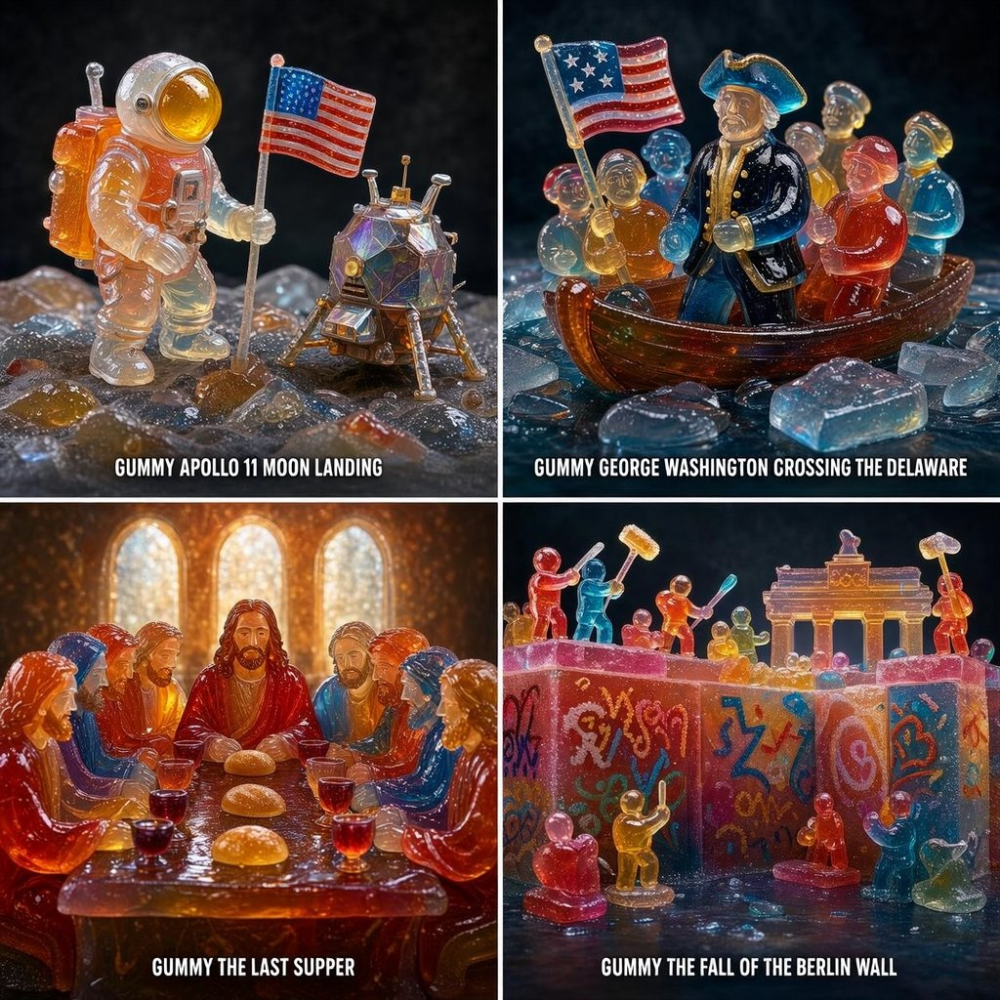 | 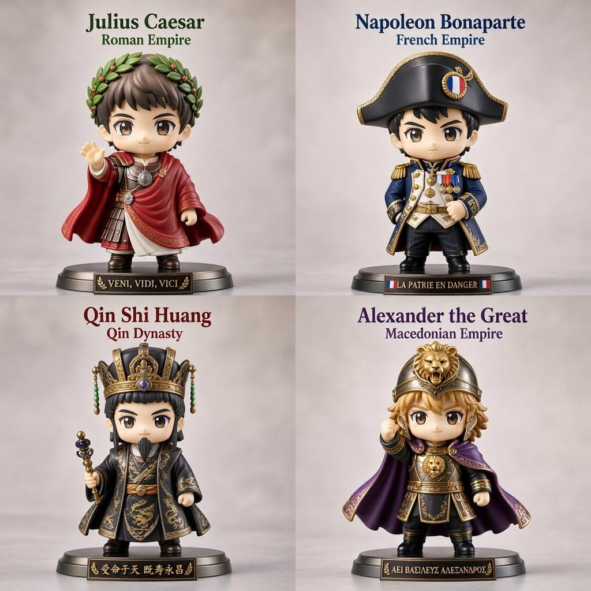 |

**Prompt:**

```
1) 2x2 grid, do this for 4 famous historical scenes in human history {Input = Subject}
Function Render_Jelly_Scatter ($ Subject)
Anchor:[Gummy $ Subject] :: [Sub-Surface Scattering]::5
Morphology:$Subject made of translucent gelatin or thick fruit flesh, soft wobbly geometry, glossy skin, condensation::4
Material Physics: Sugar coating, sticky surface, light passing through the material to show inner seeds/structure, jelly physics::3
Illumination: Backlight to highlight translucency, softbox reflections on the glossy surface, bright and colorful::2
Render Stack: Macro product photography, 100mm lens, 8k, Ray-traced render::1
Negative:[Opaque, matte, dry, metal, stone, sharp edges, dark]::-1

2) 2x2 grid, do this for 4 famous historical emperors and their empires {Input = Subject}
Function Render_Nendoroid ($ Subject)
Anchor:[Chibi $ Subject] :: [Anime Figure Style]::5
Morphology: Head-to-body ratio 1:2, large eyes, small nose, jointed neck and arms, cute posing::4
Material Physics: Smooth high-quality PVC, matte skin, glossy hair, magnetic stand::3
Illumination: Bright anime studio lighting, vibrant colors, soft specular highlights::2
Render Stack: Good Smile Company style, 8k, Figure Photography::1
Negative:[Realistic proportions, scary, complex texture, dark, gritty]::-1
```

> [!NOTE]
> The author's verbatim prompt pair, run as two separate 2x2 concept grids. Strong examples of MAI-Image-2.5 handling stylized material systems and collectible-figure aesthetics.

---

### Case 6: [Cybernetic Horse in Luminous Hall](https://x.com/RockGrokAI/status/2062529686480081285) (by [@RockGrokAI](https://x.com/RockGrokAI))

| Output |
| :----: |
| 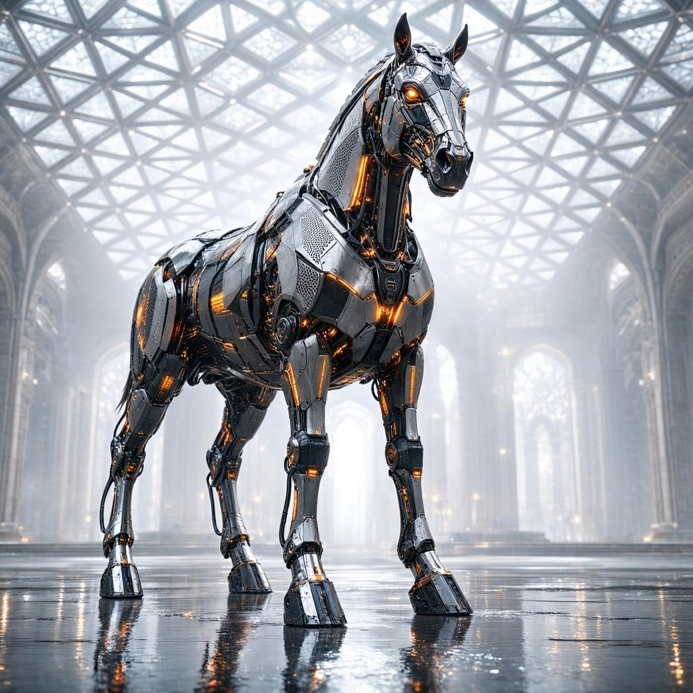 |

**Prompt:**

```
Source prompt from parent tweet by @RobotCleopatra:
a formidable, highly detailed, [robotic horse] is depicted from a low vantage point, facing forward. its body is primarily silver and dark gray, accented by vibrant orange lights within its patterned metallic skin. the creature's legs are sturdy and segmented, with detailed hooves visible on the reflective, wet ground. the environment is an expansive, brightly illuminated hall featuring an intricate, geometric ceiling grid and distant architectural arches that fade into a bright, almost ethereal background.
```

> [!NOTE]
> The prompt is public in-thread from the parent tweet, while this reply shows MAI-Image-2.5's output. Useful sci-fi environment + subject-material case with a clean single-image result.

### Case 7: [サイバーパンク女騎士](https://x.com/madonomori/status/2065343169529806875) (by [@madonomori](https://x.com/madonomori))

| Output |
| :----: |
| 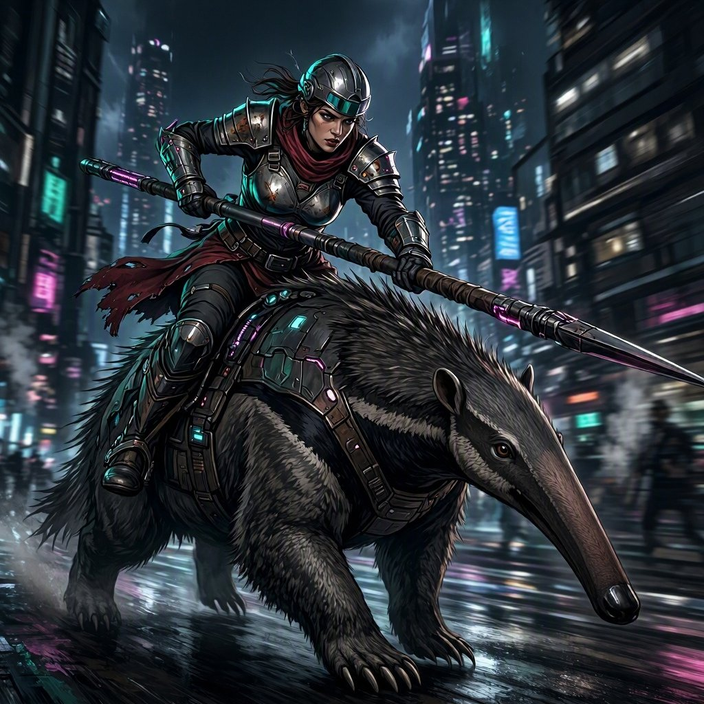 |

**Prompt:**

```
オオアリクイにまたがり槍を構えて突進する中世の女騎士。サイバーパンク風
```

> [!NOTE]
> The author published the prompt directly in the tweet text. This is a compact Japanese prompt showing MAI-Image-2.5-Flash handling creature riding, armor, weapon pose, and cyberpunk city styling in one image.

---

### Case 8: [Paysage de Volkswagen Bus au clair de lune](https://x.com/stevegilham1/status/2066187534401479033) (by [@stevegilham1](https://x.com/stevegilham1))

| Résultat |
| :----: |
| 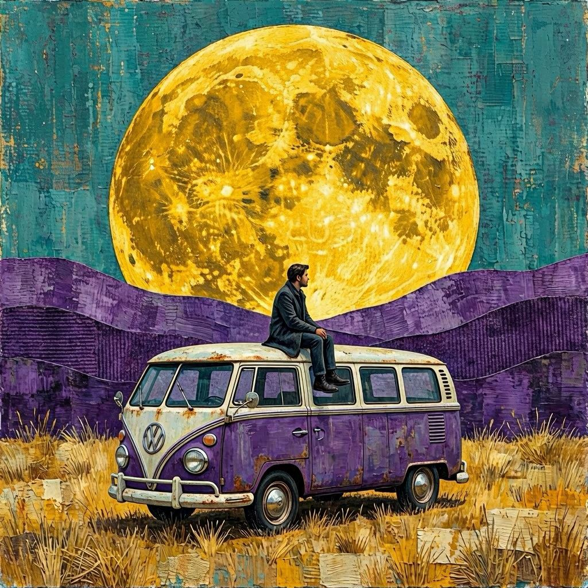 |

**Prompt:**

```text
Source prompt from parent tweet by @BeanieBlossom:
this artwork features a large, textured yellow full moon dominating the upper half of the frame against a distressed teal sky. wavy, textured purple hills form the middle ground. a white and purple volkswagen type 2 (bus) is centrally placed in the lower half, parked on a field of golden dry grass. a figure in dark attire is seated on the roof of the van, looking towards the right side of the image.
```

> [!NOTE]
> Le prompt public se trouve dans le tweet parent de @BeanieBlossom, tandis que cette réponse montre l’exécution de ce prompt par Steve Gilham avec MAI-Image. Ce cas est conservé comme solide référence de style affiche, car les limites du prompt sont claires et le rendu MAI est visuellement propre.

---

## 🆚 Comparaisons et exemples de la communauté

### Case 1: [Object Removal Edit, Text & Car](https://x.com/WolfRiccardo/status/2061902205779632501) (by [@WolfRiccardo](https://x.com/WolfRiccardo))

| Entrée | Résultat |
| :---: | :----: |
|  | 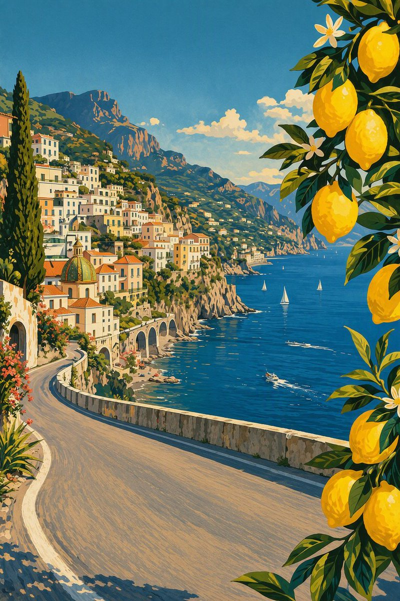 |

**Entrée:** Importez une photo à modifier.

**Prompt:**

```
texts and car / remove
```

> [!NOTE]
> Prompt mot pour mot de l'auteur. MAI-Image-2.5 (High) gère les instructions de suppression concises — nommez les éléments à effacer et il nettoie la scène en préservant l'arrière-plan.

---

### Case 2: [MAI-Image-2.5 vs Nano Banana Pro](https://x.com/eyupyusufa/status/2061934129046843543) (by [@eyupyusufa](https://x.com/eyupyusufa))

| MAI-Image-2.5 | Nano Banana Pro |
| :-----------: | :-------------: |
|  | 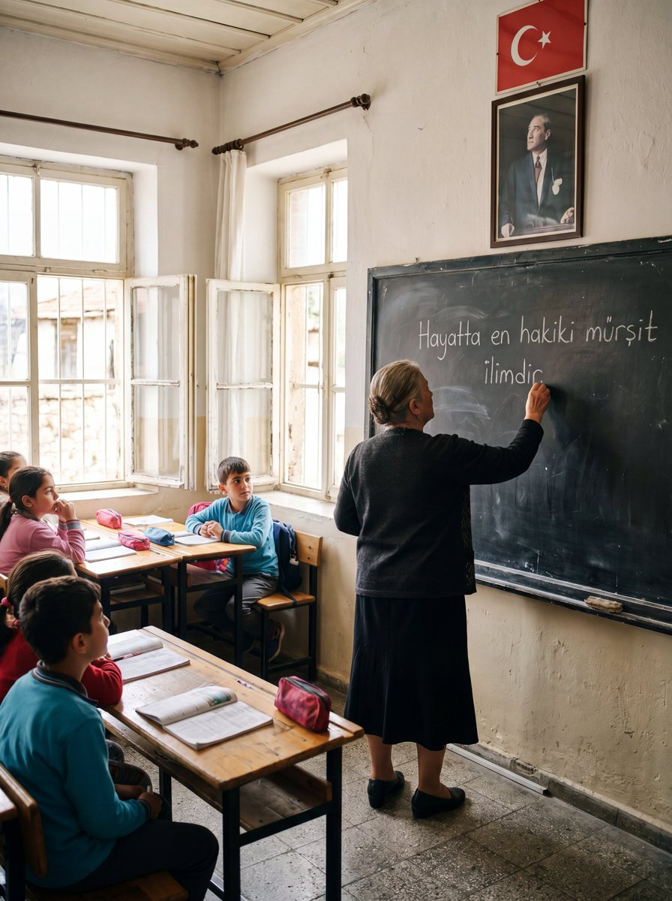 |

> [!NOTE]
> Exemple comparatif de la communauté — même prompt sur les deux modèles, publié sans prompt réutilisable. Un test de rendu de texte (la citation d'Atatürk "Hayatta en hakiki mürşit ilimdir.") montré en référence sur la façon dont MAI-Image-2.5 se compare à Nano Banana Pro.

---

### Case 3: [Text-to-Image vs Nano Banana 2](https://x.com/mrc_748/status/2061992269750862314) (by [@mrc_748](https://x.com/mrc_748))

| MAI-Image-2.5 | Nano Banana 2 |
| :-----------: | :-----------: |
| 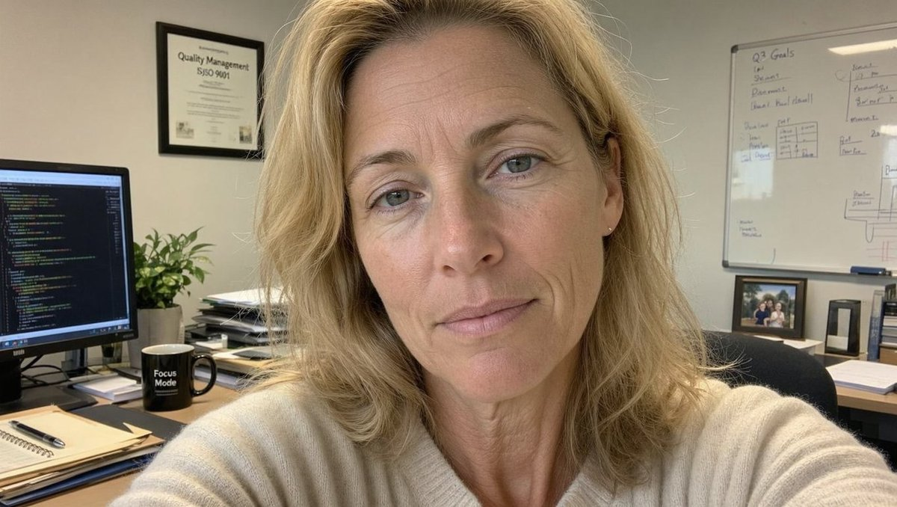 |  |

> [!NOTE]
> Exemple comparatif de la communauté — même prompt sur les deux modèles, publié sans prompt réutilisable. L'auteur a réalisé une douzaine de comparaisons text-to-image et a indiqué que MAI-Image-2.5 arrivait en tête à chaque fois.

---

### Case 4: [Flash vs Standard](https://x.com/400_yen/status/2061912907244241093) (by [@400_yen](https://x.com/400_yen))

| MAI-Image-2.5-Flash | MAI-Image-2.5 |
| :-----------------: | :-----------: |
| 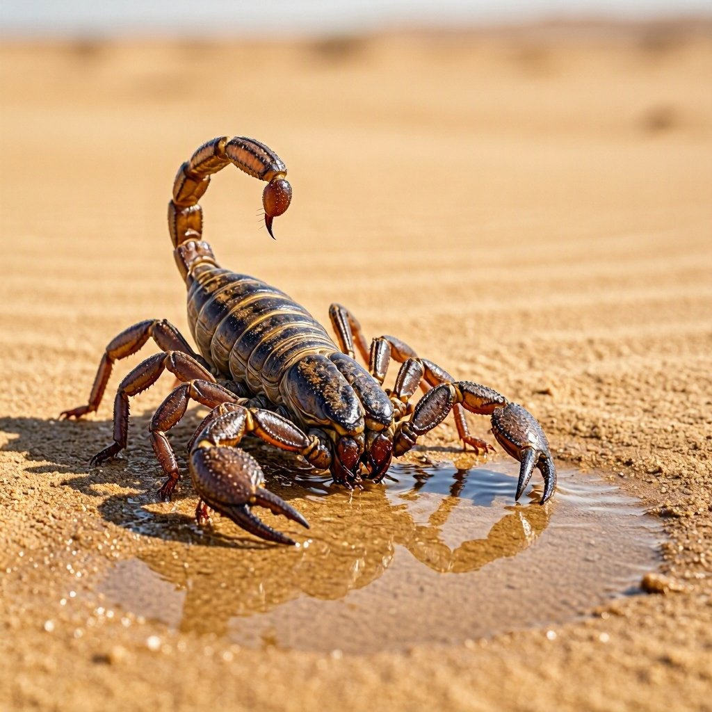 |  |

> [!NOTE]
> Exemple comparatif de la communauté — l'auteur a comparé les niveaux Flash et standard avec le même prompt sans le publier. Montré en référence pour la différence de qualité entre les deux niveaux.

---

### Case 5: [Official Editing Before/After (OneDrive Photos)](https://x.com/MicrosoftAI/status/2062240408638222471) (by [@MicrosoftAI](https://x.com/MicrosoftAI))

| Avant → Après |
| :----: |
| 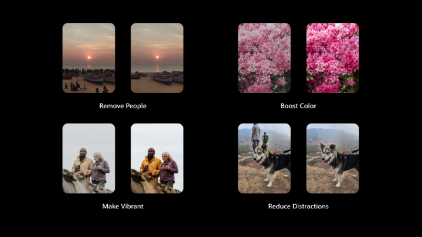 |

> [!NOTE]
> Exemples officiels de retouche avant/après de Microsoft (déploiement dans OneDrive Photos) : **Supprimer des personnes**, **Renforcer la couleur**, **Rendre éclatant** et **Réduire les distractions** — chacun présenté en paire originale/retouchée, illustrant un nettoyage d'arrière-plan qui préserve la scène d'origine.


### Case 6: [Anime Character Sheet Comparison](https://x.com/wish_society/status/2062519409923751965) (by [@wish_society](https://x.com/wish_society))

| Nano Banana | MAI-Image-2.5 |
| :---------: | :-----------: |
| 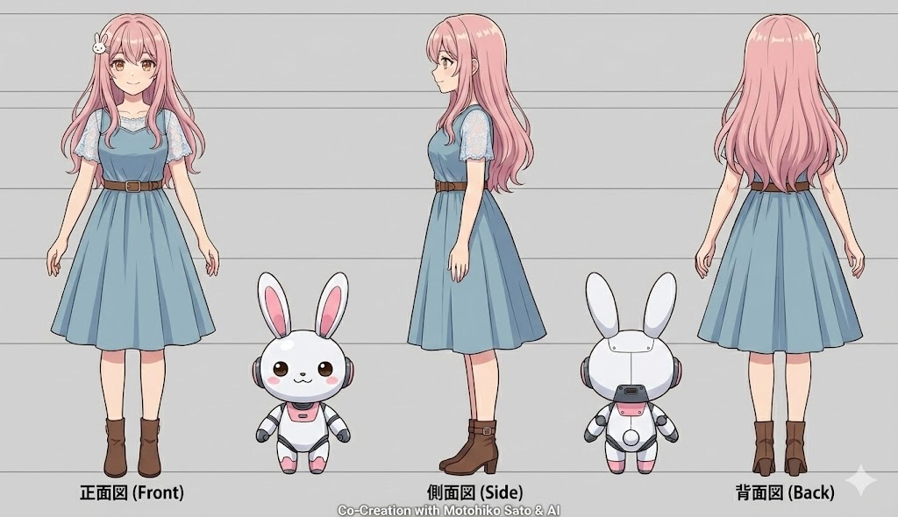 | 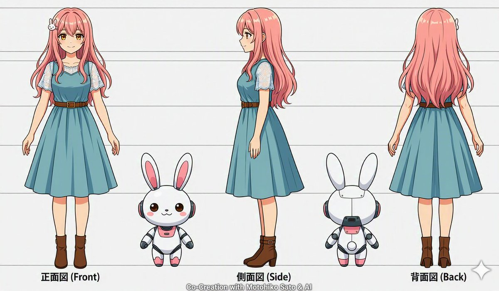 |

> [!NOTE]
> Community comparison example — no reusable prompt was published, but the side-by-side is still useful as a finishing/editing reference. The author's takeaway was that MAI-Image-2.5 preserved color richness and fidelity better than GPT Image and Nano Banana during final-stage edits.

### Case 7: [Flooded Taiga Night Train Edit](https://x.com/SqueakAlGaib/status/2063043138034491659) (by [@SqueakAlGaib](https://x.com/SqueakAlGaib))

| Before | After |
| :----: | :---: |
| 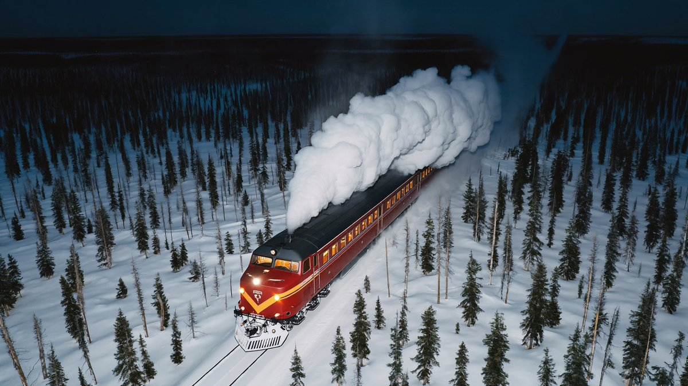 | 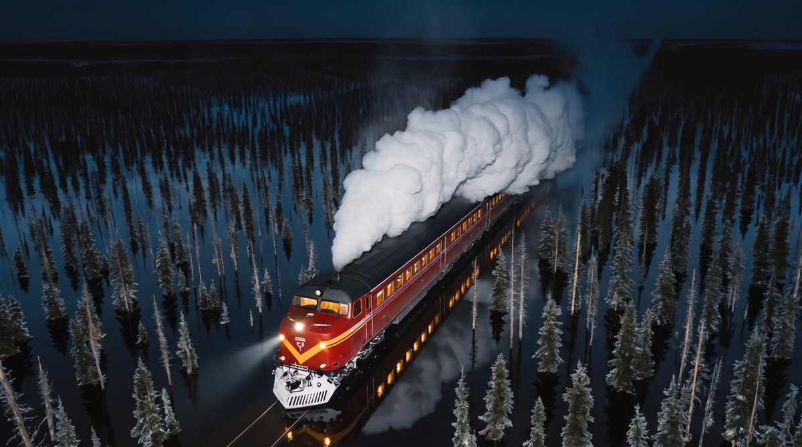 |

**Input:** Upload the original aerial train image before editing.

**Prompt:**

```
Edit the attached image of the aerial night shot of the red Trans-Siberian locomotive moving through the snowy Siberian taiga forest.

Transform the landscape between all the trees into a vast, shallow floodwater surface. Every gap between trees — the ground, the snow-covered forest floor, all open spaces — is now covered in still, dark, mirror-flat water approximately 1–1.5 meters deep. The pine trees now stand in this water up to their first or second branches, their trunks disappearing into the black reflective surface below.

The water must be photorealistic and physically accurate. It is still and glassy — not turbulent — so it acts as a near-perfect dark mirror. It must reflect the following elements accurately and in correct perspective: the deep dark-blue night sky above, the white steam/smoke plume from the locomotive, the warm amber glow from the train's passenger car windows, and the cold white headlight beam from the engine. Each reflection should have a slight wavering distortion consistent with very shallow still water, not completely flat glass.

The train tracks must appear to run just at or slightly above the waterline — as if elevated on a low embankment that barely clears the flood level. The train itself is completely unchanged — same red livery, same position, same heading, same steam plume, same lights. Do not alter any aspect of the locomotive or its cars.

The snow on the branches of the trees remains — the flooding came from below, not precipitation. Upper branches are still snow-laden; the lower submerged trunks show waterlogged bark texture where they meet the flood surface.

The overall color palette shifts slightly — the ground, previously white snow, is now reflective black water, making the red train and amber windows pop even more dramatically as the only warm elements in a cold, flooded, nocturnal landscape. Maintain the aerial 45-degree drone perspective exactly. Do not alter the sky, the steam, the forest canopy silhouette, or the train in any way.
```

> [!NOTE]
> The tweet is a community comparison post, but the MAI-Image-2.5 edit prompt is fully public and reusable. This case is kept mainly as an image-editing reference for large-scale environment transformation while preserving subject identity and camera angle.

### Case 8: [Nested Fruits Cutaway](https://x.com/aniruddhadak/status/2065132345741697157) (by [@aniruddhadak](https://x.com/aniruddhadak))

| Output |
| :----: |
| 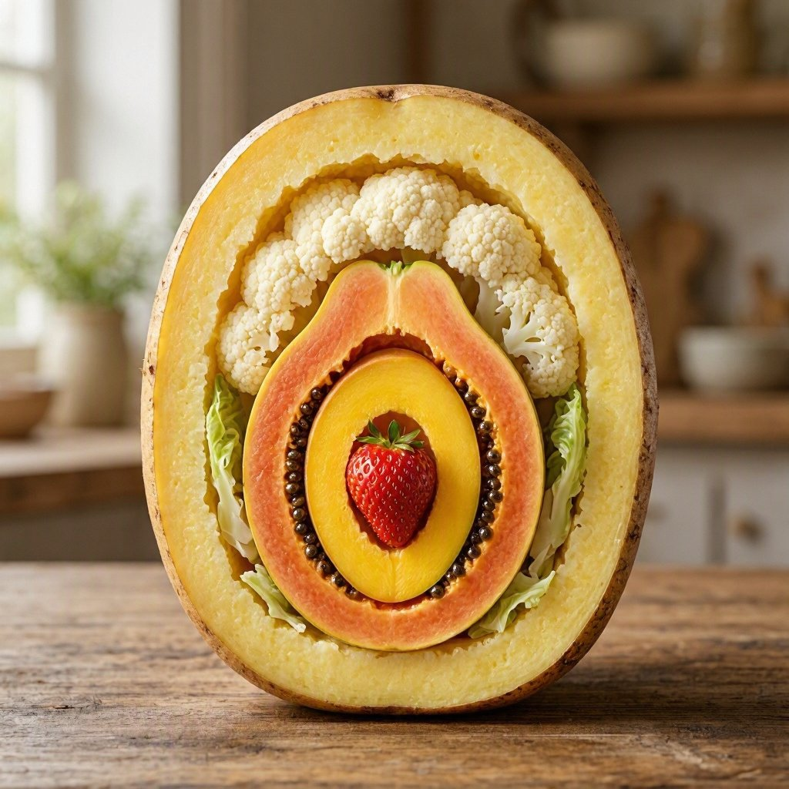 |

**Prompt:**

```
strawberry inside mango inside papaya inside gobi inside a potato
```

> [!NOTE]
> Low-signal community post, but the prompt is public, concise, and reusable as a nested-object cutaway stress test for MAI-Image-2.5-Flash.

---


## 🙏 Remerciements

Ce dépôt s'est inspiré d'excellentes collections de prompts ouvertes et d'exemples partagés par la communauté.

Merci aux créateurs et contributeurs qui ont partagé publiquement leur travail avec MAI-Image-2.5 et rendu ces études de cas possibles.

- [@atomtanstudio](https://x.com/atomtanstudio)
- [@grmchn4ai](https://x.com/grmchn4ai)
- [@doerstokyo342](https://x.com/doerstokyo342)
- [@annjose](https://x.com/annjose)
- [@SqueakAlGaib](https://x.com/SqueakAlGaib)
- [@thesoragirls](https://x.com/thesoragirls)
- [@Chain_Loader](https://x.com/Chain_Loader)
- [@mk0600937254693](https://x.com/mk0600937254693)
- [@WaifuGacha](https://x.com/WaifuGacha)
- [@genel_ai](https://x.com/genel_ai)
- [@RockGrokAI](https://x.com/RockGrokAI)
- [@WolfRiccardo](https://x.com/WolfRiccardo)
- [@eyupyusufa](https://x.com/eyupyusufa)
- [@mrc_748](https://x.com/mrc_748)
- [@400_yen](https://x.com/400_yen)
- [@MicrosoftAI](https://x.com/MicrosoftAI)
- [@arena](https://x.com/arena)

*Nous ne pouvons pas garantir que chaque cas soit attribué à son créateur d'origine. Si quelque chose doit être corrigé, ouvrez une issue et nous la mettrons à jour.*

Si vous avez d'autres cas de prompts MAI-Image-2.5 intéressants à partager, n'hésitez pas à nous contacter et à nous aider à enrichir la bibliothèque de prompts Evolink.

[](https://www.star-history.com/#EvoLinkAI/awesome-mai-image-2.5-prompts&Date)
