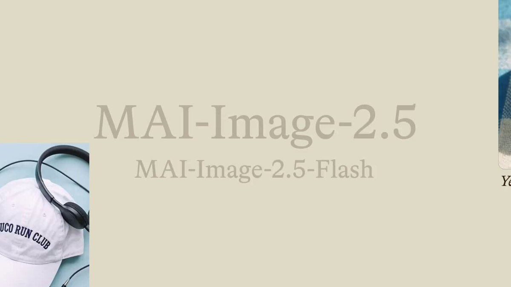

# 🆚 Comparison & Community Examples

### Case 1: [Object Removal Edit, Text & Car](https://x.com/WolfRiccardo/status/2061902205779632501) (by [@WolfRiccardo](https://x.com/WolfRiccardo)) `🖼️ Image→Image`

| Output |
| :----: |
|  |

**Input:** Upload one photo to edit.

**Prompt:**

```
texts and car / remove
```

> [!NOTE]
> The author's verbatim prompt. MAI-Image-2.5 (High) handles terse removal instructions — describe the elements to delete and it cleans the scene while preserving the background.

> Source: [@WolfRiccardo on X](https://x.com/WolfRiccardo/status/2061902205779632501)

---

### Case 2: [MAI-Image-2.5 vs Nano Banana Pro](https://x.com/eyupyusufa/status/2061934129046843543) (by [@eyupyusufa](https://x.com/eyupyusufa)) `🆚 Comparison`

| Output (left: MAI-Image-2.5, right: Nano Banana Pro) |
| :----: |
|  |

> [!NOTE]
> Community comparison example — the author published the side-by-side result without a reusable prompt. Included for reference on how MAI-Image-2.5 stacks up against Nano Banana Pro.

> Source: [@eyupyusufa on X](https://x.com/eyupyusufa/status/2061934129046843543)

---

### Case 3: [Image-Edit Leaderboard #2 Take](https://x.com/berryxia/status/2061988157349130675) (by [@berryxia](https://x.com/berryxia)) `🆚 Comparison`

| Output |
| :----: |
|  |

> [!NOTE]
> Community example — image-editing comparison shared alongside commentary that MAI-Image-2.5 reached #2 on the image-edit leaderboard. No reusable prompt was published.

> Source: [@berryxia on X](https://x.com/berryxia/status/2061988157349130675)

---

### Case 4: [MAI-Image-2.5 vs 2.5-Flash Positioning](https://x.com/WesRoth/status/2062021457824395476) (by [@WesRoth](https://x.com/WesRoth)) `🆚 Comparison`

| Output |
| :----: |
|  |

> [!NOTE]
> Community overview — MAI-Image-2.5 is positioned as the premium maximum-fidelity tier, while MAI-Image-2.5-Flash offers similar quality at lower cost. Reference material, not a reusable prompt.

> Source: [@WesRoth on X](https://x.com/WesRoth/status/2062021457824395476)
