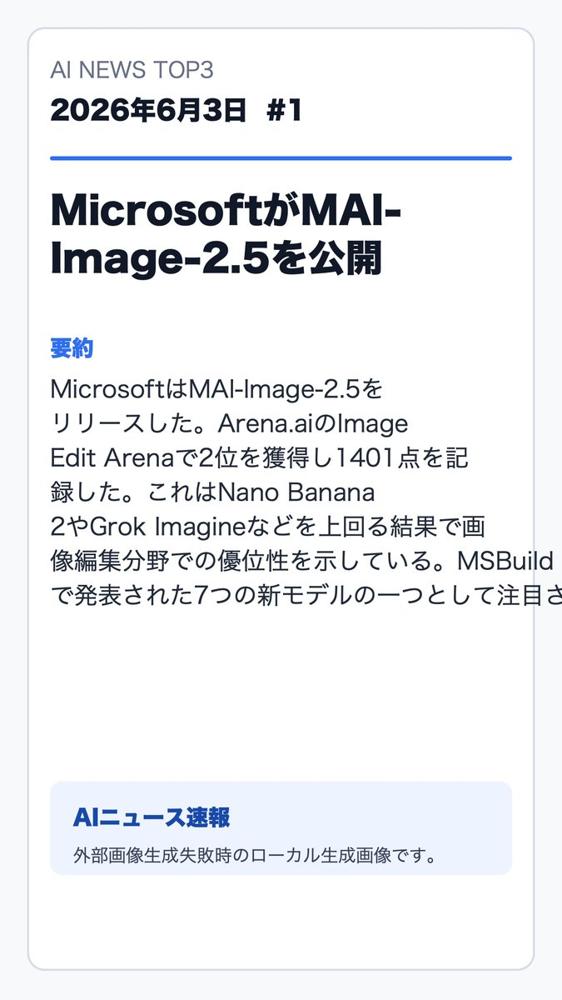

# 🖥️ UI & Social Media Mockup Cases

### Case 1: [AI News Top 3 Infographic Card](https://x.com/seisei_ai_1st/status/2061997864646222028) (by [@seisei_ai_1st](https://x.com/seisei_ai_1st)) `🔤 Text→Image`

| Output |
| :----: |
|  |

**Prompt:**

```
A clean social-media infographic card titled "AI News Top 3". Three numbered ranked items stacked vertically, each with a bold headline, a small icon, and a one-line caption. Modern flat design, strong typographic hierarchy, balanced grid layout, brand-consistent accent color, 9:16 vertical aspect ratio suitable for a feed post. Crisp, legible text rendering.
```

> [!NOTE]
> **Reconstructed prompt.** Replace the three ranked items and the title with your own content. Demonstrates MAI-Image-2.5's text-rendering and layout for social cards.

> Source: [@seisei_ai_1st on X](https://x.com/seisei_ai_1st/status/2061997864646222028)

---

### Case 2: [Model Lineup Social Card](https://x.com/tmiyatake1/status/2061961813009326580) (by [@tmiyatake1](https://x.com/tmiyatake1)) `🔤 Text→Image`

| Output |
| :----: |
|  |

**Prompt:**

```
A product-announcement social card listing a family of AI models. A bold title at the top, then five rows, each with a model name on the left and a short one-line capability description on the right, separated by thin dividers. Dark background, high-contrast white text, subtle accent highlights on the model names, tech-keynote visual style, clean sans-serif typography, 16:9 layout.
```

> [!NOTE]
> **Reconstructed prompt.** Edit the title and the model rows for your own lineup. Good template for keynote / launch summary cards.

> Source: [@tmiyatake1 on X](https://x.com/tmiyatake1/status/2061961813009326580)
